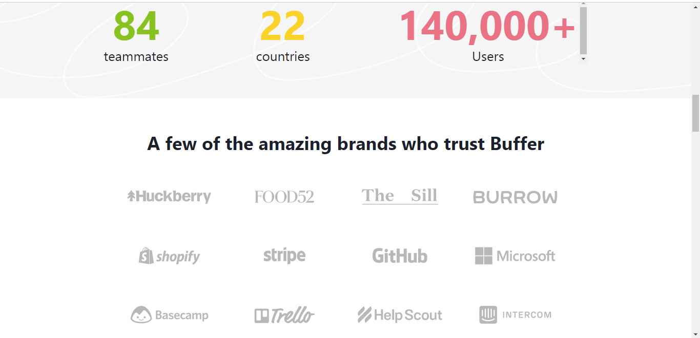

<h1 align="center"> Buffer Website Clone</h1>
<h2>It's a application of managing all the social meadia account at one place with some additional features.  </h2>  

<div>
<h1>Deployment link</h1>
https://bufferr.netlify.app/
</div>
<h2>Tech stack used for the application</h2>
<div>

  
    
    
    
        
            
    
</div>

<p>
Buffer is a application of managing all the social meadia account at one place with some additional features. It is a collaborative project built by a team of 4 and executed in 5 days.
</p>
<p align="center">

<p>

<h2> Screens </h2>
<ul>
<li>Homepage</li>
<li>Login/Logout</li>
<li>Channels</li>
<li>Connect Channel</li>
<li>Data analytics</li>
<li>Publishing</li>
<li>Engagement</li>
<li>About</li>
</ul>

<h2> Features </h2>

<ul>
<li>Fully responsive</li>
<li>Account login and logout functionality.</li>
<li>Add and remove channels for all social media plateforms </li>
<li>Add a post on calender</li>
<li>View analytics in the graphs from</li>
<li>View the comments and likes in the enagagements</li>
</ul>

<h2>Glimpses of Buffer</h2>

<p align="center">


 





</p>

<h2>Getting Started</h2>
<div>
<p>is project was built using React,Redux, Chakra UI, CSS, JavaScript,HTML. It is an online social media marketing management web application and for running on your local environment you should follow these guidelines</p>
<h3>Prerequisites</h3>
<ul>
<li>React</li>
<li>Redux</li> 
<li>HTML</li>
<li>CSS</li>
</ul>

<h3>Setup</h3>


```
git clone https://github.com/vin9012d/painful-harbor-5807.git
```

<h3>Install</h3>

<p>To install all the dependences of the project, run the following command:</P>

```
npm install
```

<p>To run the application got to the client folder and run the following command:</P>
```
npm run start
```
</div>

<h2>Contact<h2>
<p align="left">
    <a href="https://www.linkedin.com/in/vin9012d/">
        
    </a>
      <a title="vin9012c@gmail.com.com" href="mailto:vin9012c@gmail.com.com">
        
    </a>
 
    
  <p>© 2022 Vinod Chaudhari</p>
</p>
<h2>Show your support</h2>
<p>Give a star if you like this project!</p>

